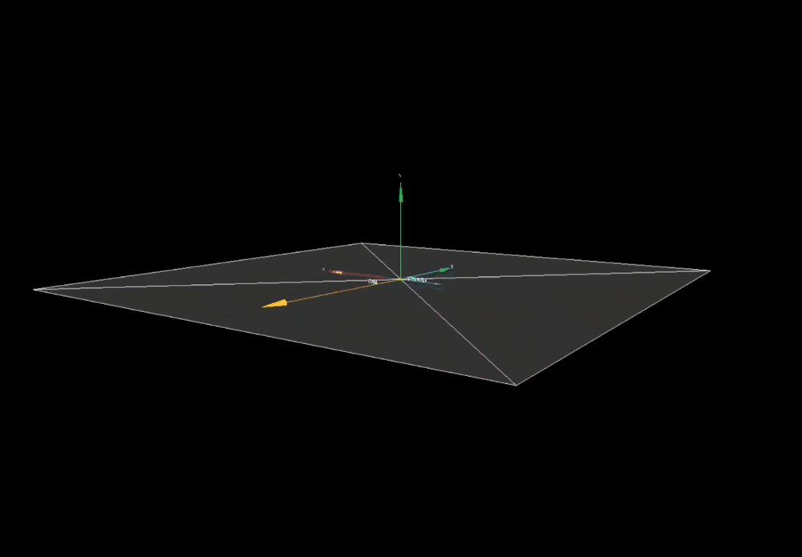
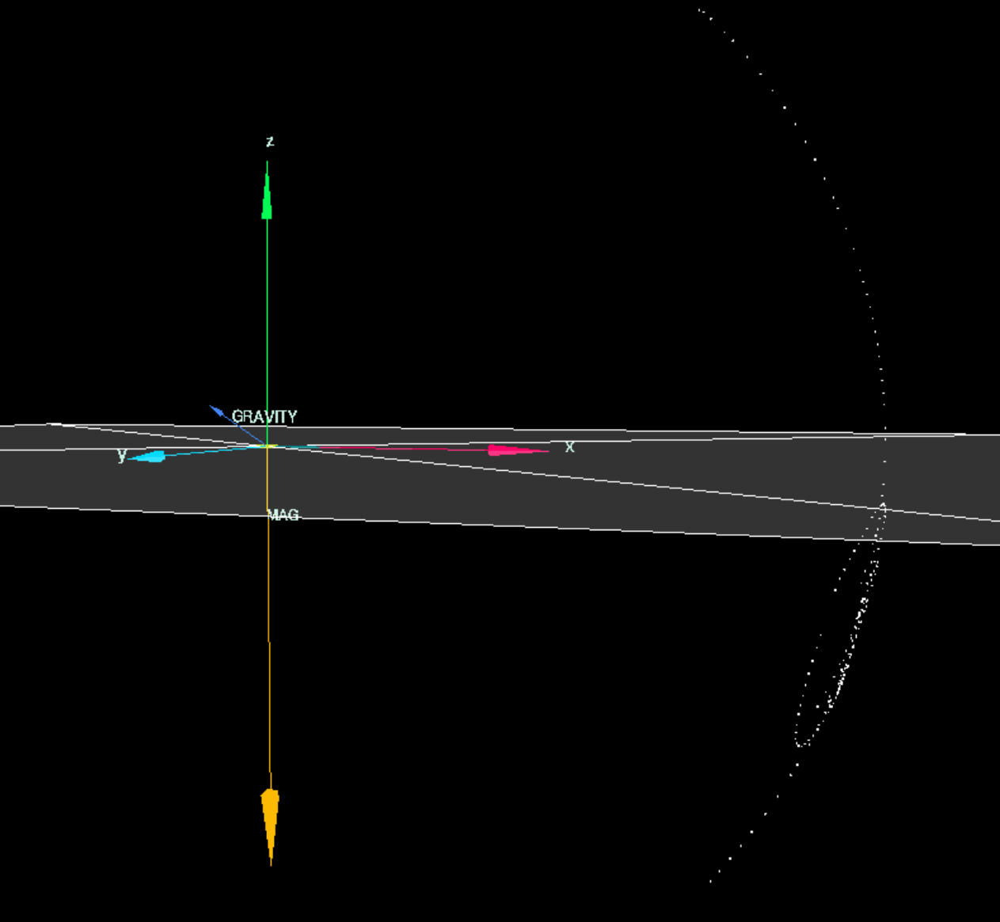
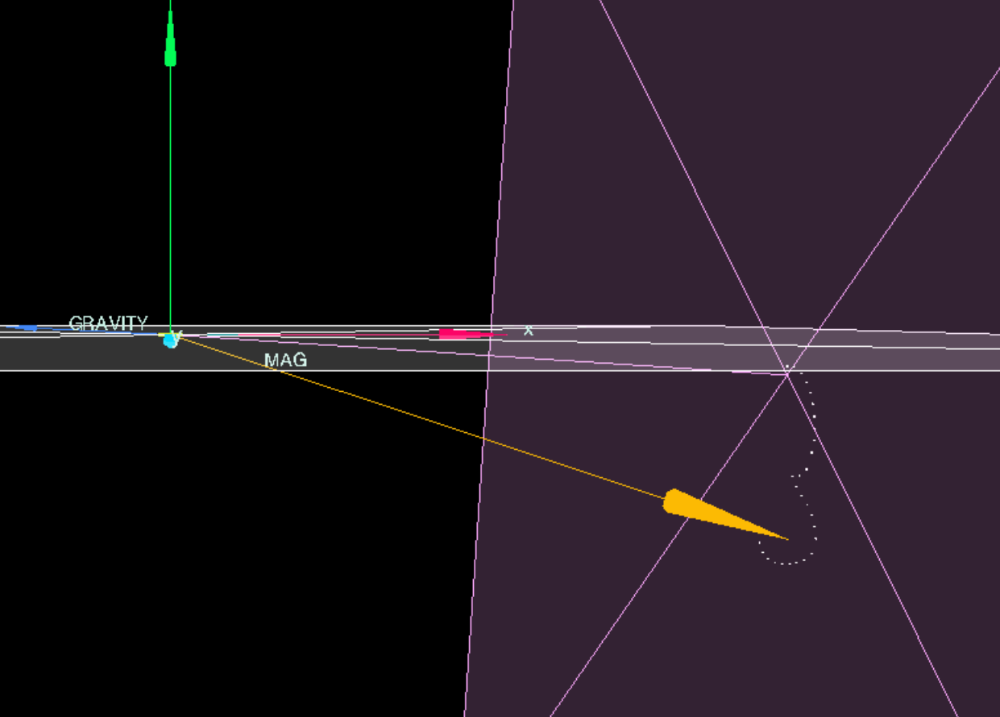
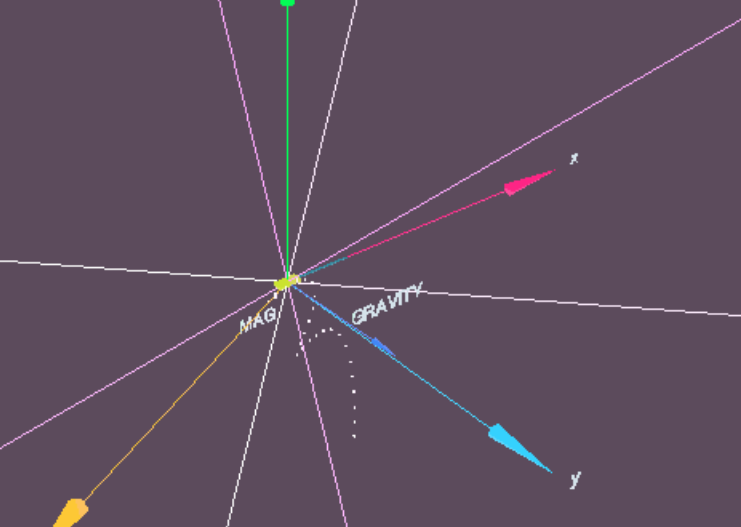
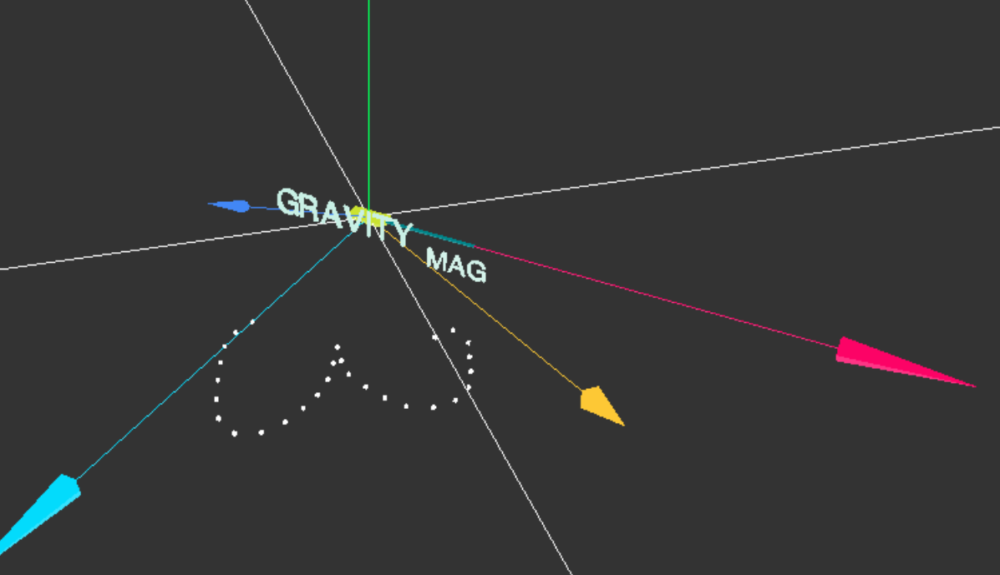
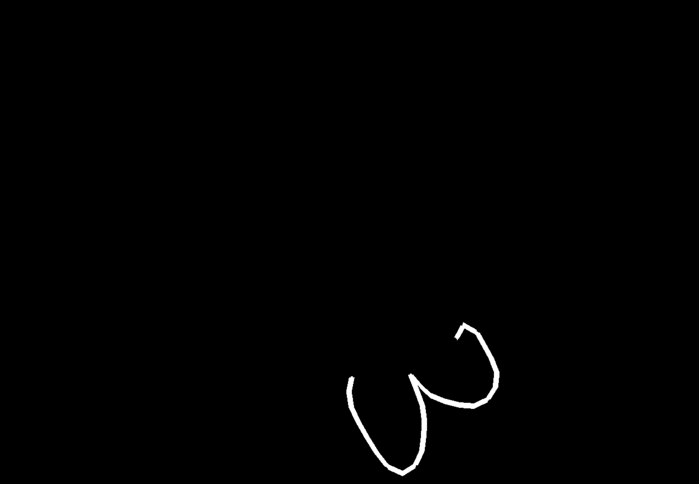
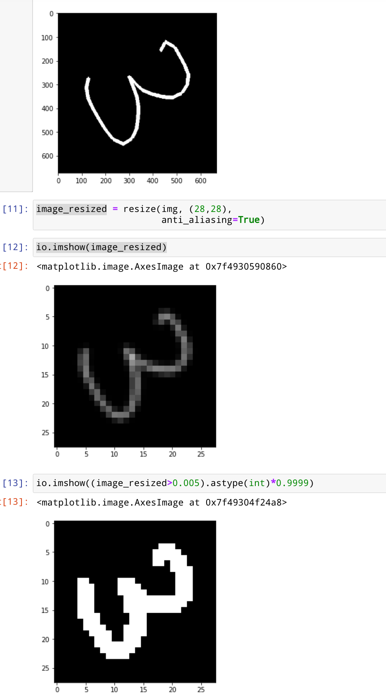
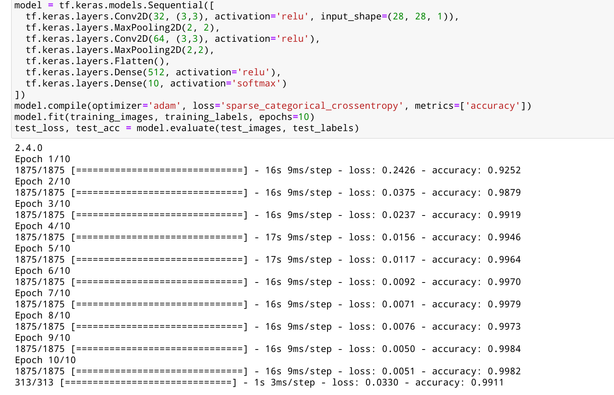
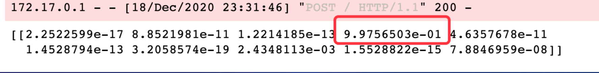

# InkTracer UCLA ECE M202 
~~Haoran Ma 405352274~~(dropped)
Shen Teng 104758168

## 1. Overall project goals
The project is aim to recognize handwriting by attaching Arduino Nano 33 BLE Sense to the end of the pen-like object.
Currently, all handwriting input devices interact with a touch screen i.e. Apple pen, Surface pen. It would be great that we can transform any pen-like object as an digital input device without the restrictions of surface type. Imagine that a writer can write an article on the paper meanwhile its digital copy is generated on the smart devices. 
To achieve this, IMU sensor is the key. The paper "Pentelligence" uses 6-axis IMU sensor and audio sensor and feed the data through layers of neural network to recognize **digits** only.
This project is aimed to achieve a similar goal with a attempt to recognize digits and letters. 

Here is a picture how I bind the Arduino to a pencil using only tape.

Quick Demo https://youtu.be/tCS6XdM0C54

Final Presentation https://youtu.be/1LgVE7xhWh0

## 2. Technical Approach  
Plan 1: 
We reconstruct the trajectory of the Arduino from the IMU sensor data in 3D space,  and then project the trajectory into 2D plane.
Then we process that image with a series of transformation, and feed it into well-trained existing CV neural networks so that we are able to recognized a broad spectrum of symbols.

Plan 2 :
Feed IMU sensor data directly into LSTM, TCN etc. And in this case, we need to take care of issues like collecting raw data and few-shot learning.

*Plan 2 is aborted due to the time limitation, lack of manpower, and Covid-19 pandemic situation.

Currently training Neural Network using sensor data directly is quite popular. I have this project in my mind for a long time. I always want to see if Plan 1 would be manageable since I really like the idea which decouples the task into two subtasks 1) trajectory reconstruction 2) image recognition where we can reuse what computer vision scientists have been doing.

## 3. Implementation, result, and key findings.
### 3.1. Implementation

#### 3.1.1 Visualization

First I built a framework to visualize the IMU sensor readings and trajectory of the pen tip using some computer graphics knowledges with the help of Web browser and 3D  graphic library[Three.js](https://threejs.org/).  This is extremely helpful during the prototype.

#### 3.1.2 Handle Sensor Data

My original plan is to 1) get the attitude of the Arduino using sensor fusion techniques like ahrsfilter or complementary filter, 2) eliminate the gravitational force using the attitude information, and 3) reconstruct trajectory by double integrating the accelerometer readings after gravity is compensated. 

However the plan doesn't work well due to my miserable amount of DSP knowledge since sensor fusion filters have response time and double integrating the accelerometer readings is far from accurate. 

Luckily, through my visualization tool, I found out the tip of Magnetometer Reading Arrow reflects the motion of the pen-tip quite well (with a slight distortion).

1.  **Calibrate Magnetometer** using magcal function from Matlab to remove affect from soft-iron and hard-iron source.

2. Apply **Low Pass Filter** on Magnetometer reading. Readings from magnetometer is used to draw the trajectory. However, it is quite noisy. Luckily LPF does the work easily. But it introduces some response time.

3. Apply **Low Pass Filter** on Accelerometer reading. This gives us a rough estimation of gravity force. I use (Acc Reading - Gravity) to detect if pen is raised of not.

#### 3.1.3 3D Transformations

After we get data from sensors. We are able to draw dots in the 3D space. Through a series of 3D transformation, we can get a 2D image at the end.

Notice that although these are done on my visualization framework. They are essentially a bunch of 3D matrix operations.

Step 1: Getting some dots in 3D space

Step 2:  Putting dots on a Plane

As you can see, the readings will be on the surface of a sphere if we do the calibration correctly. Actually in the real implementation, I only use the direction component of the magnetometer reading. 

So I extend the unit magnetometer reading until it hits the plane and draw the points on the intersection.

Step 3: Moving those dots to the origin

Translate points to the plane (normal vector without distance offset). 

Rotate those point on to the X-Y plane.

Step 4: Take a ScreenShot

Hide other 3D objects, Connect dots with lines, Set the camera position and angle. 

I have this.

#### 3.1.4 2D Transformation

We send the image to the python server.  

Perform:

1. Crop out black areas, and give the some padding

2. Downsample the image to fit the data as others in MNIST dataset

3. Enhance the contrast ratio

4. Apply rotation 

   

#### 3.1.5 Neural Network

In this work, for proof of concept I only test digit recognition. A very simple CNN does the work with 99% accuracy on MNIST dataset.

### 3.2 Results and Key Findings

It is very hard for me to give out a systemic, thorough evaluation section here due to the time limitation and lack of manpower.

In a less responsible wording, the method can generate very good prediction if user draws the digits slow and steady i.e. the image beneath shows the prediction result of digit "3". The result of correct index is orders of magnitude higher than the rest. 

But I also admit that it doesn't perform very well under these condition,

1. User rotate the pen along the longer axis of the pen a lot. This generates highly distorted trajectory
2. The angle of rotation in the last step of 2D transform is not set well. Since the NN is trained with MNIST where all the input images are not rotated, it doesn't handles rotated image well. 

I believer incorporating finer DSP and sensor fusion techniques e.g. integrating accelerometer and gyroscope data to the trajectory reconstruction. This method can be better than directly training Neural Network using sensor data.

## 4. Prior work examples including references, and the relative novelty of your work.

[Pentelligence: Combining Pen Tip Motion and Writing Sounds for Handwritten Digit Recognition
](https://dl.acm.org/doi/10.1145/3173574.3173705)

## 5. Strengths and weakness, and future directions

#### 5.1 Strengths

1. Decouple the task in to two parts.  First, generate image of trajectory. Second, recognize image content.
2. Focus on reconstruction of trajectory. Reuse existing Models from computer vision community. No need to train new neural network.

#### 5.2 Weakness

1. Current method generates distorted pattern which may affect prediction accuracy since it is generated only using magnetometer reading.
2. Filters i.e. Low Pass Filter introduce latency.

#### 5.3 Future Directions

1. Integrate Accelerometer and Gyroscope Reading to fix distortion
2. Optimize Response Time
3. Fine Tuning the Neural Network Model using the handwriting screenshot.

## 6. Contributions of each team member
ALL -- Shen Teng

## 7. Section with links to PDF of  final presentation slides

Final Slide https://docs.google.com/presentation/d/12GhX5l9Y-OTFtnwz4juWkk0-96bTZtuqO9CzQyqtgec/edit?usp=sharing

Quick Demo https://youtu.be/tCS6XdM0C54

## 8. References

Pentelligence: Combining Pen Tip Motion and Writing Sounds for Handwritten Digit Recognition

how-to-remove-gravity-factor-from-accelerometer-readings-in-android-3-axis-accel https://stackoverflow.com/questions/3377288/how-to-remove-gravity-factor-from-accelerometer-readings-in-android-3-axis-accel

ThreeJS https://threejs.org/